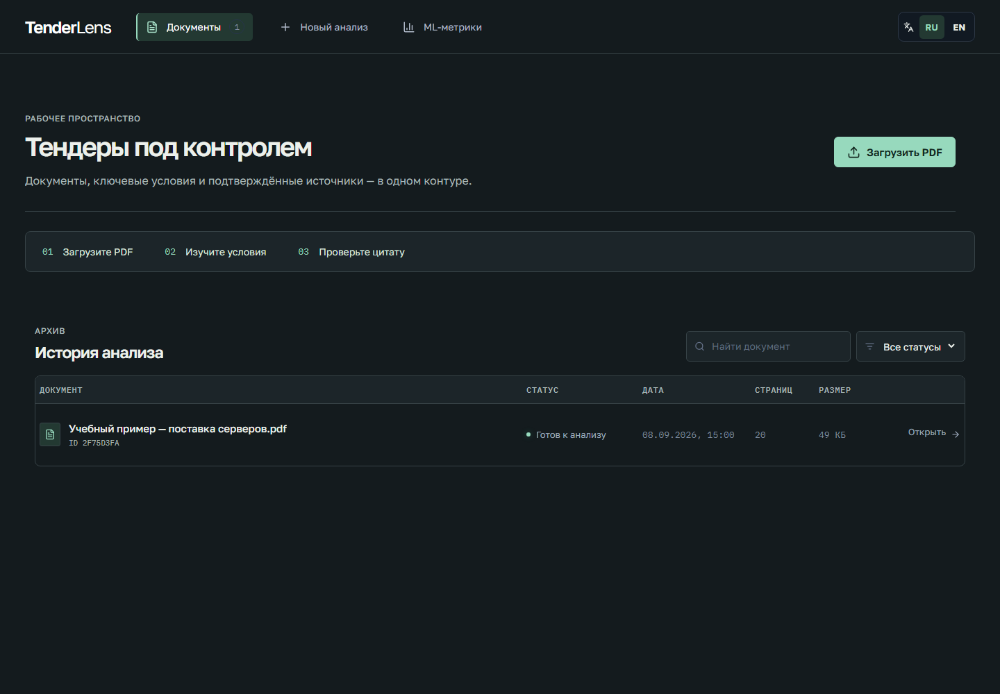
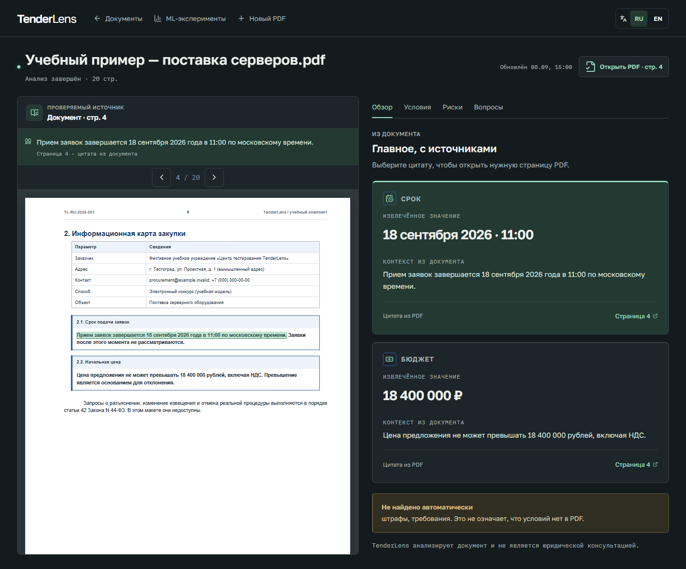

# Вариант B — внедрение

9 сентября 2026. Ветка `feat/graphite-interface`, основана на `feat/release-audit-design`.
Выбор пользователя: графитовый аналитический кабинет. Это изменения приложения,
а не только HTML-референс. В main пока не слиты.

## Что изменено

- Горизонтальная навигация, графитовые поверхности, мятный акцент. Библиотека начинается
  с загрузки и истории, без большого декоративного атласа. Компонент атласа удалён,
  его основные стили удалены; старый CSS прочих компонентов пока сохранён как базовый слой.
  `graphite.css` задаёт выбранную тему и адаптивную компоновку, а не второй интерфейс.
- PDF слева, вкладки и результаты справа. На телефоне результаты первыми, источник
  можно открыть в полноэкранной панели и закрыть Escape. Оригинал доступен без цитаты.
- Вместо круговой схемы — реальные `value`/`summary` из API, крупные значения и видимые
  ссылки на страницы. Скрыт технический процент правила, «Проверено» заменено на
  «Цитата из PDF» в карточках. Числа и даты не выдумываются frontend.
- Правильный PDF: локальный URL связан с documentId; при смене документа сбрасываются
  цитата, страница и состояние вопроса. Upload не ждёт обновления списка для navigation.
- Готовность PDF отделена от готовности сводки; при ошибке анализа доступны PDF и Q&A.
- ResizeObserver подключается после асинхронной загрузки PDF. Цитата не подсвечивается
  на другой странице. Прокрутка к выделению ограничена PDF viewport: заголовок панели
  не уезжает, вся страница не прыгает.
- Фокус в модалках, Escape и возврат на кнопку; reduced motion. Исправлены единицы
  размера в EN и устаревшее сообщение, что OCR якобы не поддерживается.

## Проверки

- `pnpm test`: 14 unit-тестов прошли.
- `pnpm test:e2e`: 5 браузерных тестов прошли.
- `pnpm lint`, `pnpm format:check`, `pnpm typecheck`, production build — прошли.
- В браузерном тесте вместо `%PDF-1.4` используется существующий валидный учебный PDF.
  Проверяются текстовый слой, выделение и исчезновение выделения на другой странице.
- Отдельная регрессия: загрузка A → открытие B → reload; текстовый слой содержит
  уникальный идентификатор B, а не A.
- Проверены Q&A при 503 анализа; RU/EN; mobile 390px; source modal и upload dialog.
- Визуально просмотрены desktop и mobile. Проверки ширин 1440/768/390 без горизонтального
  переполнения документа и без JS page errors в диагностическом сценарии.
- Страница 4 учебного PDF дополнительно отрендерена Poppler и осмотрена. Файлы PDF
  не изменялись и новые реальные документы в Git не добавлялись.

Браузерные тесты и скриншоты используют **mock API + настоящий PDF**. Это проверяет
frontend, но не живую связку backend/PostgreSQL/OCR и не точность модели. Backend-код
в этом этапе не менялся; его прежние 111 тестов не выдаются за новый запуск.

## Скриншоты реализации

Данные учебные, API-ответы подготовлены для проверки интерфейса и соответствуют
сроку и бюджету на странице 4. Не являются замером качества извлечения.

## Что остаётся

Точная геометрия OCR, сопоставление диапазонов native PDF при повторяющихся цитатах,
масштабирование/прочие возможности PDF viewer, полный аудит доступности и переводов,
корректность ответов/evaluator и остальные пункты [ROADMAP](../../ROADMAP.md).
Этот этап не означает, что reranker прошёл quality gate или что все ответы стали верны.
